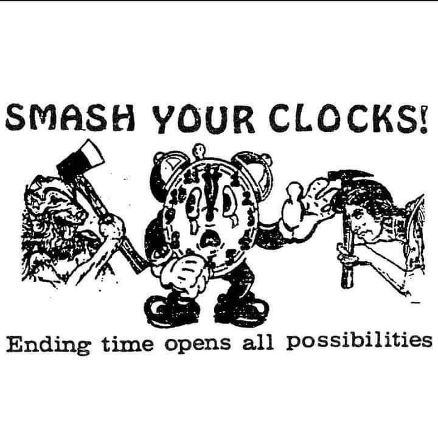

# Time, After Effects

*April 30, 2026* · [← All lectures](index.html)

https://github.com/golanlevin/lectures/tree/master/lecture_clock

Time: https://www.youtube.com/watch?v=YRSBiTF3wNw

https://www.youtube.com/watch?v=WqxXsbquzOE

**UI & Project Setup**
- Creating and configuring compositions
	- resolution
	- frame rate
	- duration
- Cover the default workspace panels, how to restore things if things get wonky
	- composition window
	- timeline
	- project panel
	- effects/character panels, toolbar
- Importing footage (drag-and-drop, File > Import)
	- What can you import? 
	- Images
	- SVG
	- AI files
	- Video
- RAM preview and playback resolution
- Timeline
	- Layer / Clipping
	- Work Area

**Concepts**
- Frames per second
	- **~10-12 fps — motion starts to read as motion.** Below this, the brain perceives a sequence of distinct images rather than continuous movement. Early animation (Disney's "Steamboat Willie", traditional hand-drawn animation) often runs at 12 fps with each frame held for two frames of a 24 fps film — "animating on twos." You see the seams clearly, but it still reads as motion. Anime traditionally uses this approach and leans into the choppiness as style.
	- **~16 fps — the historical "persistence of vision" threshold.** Silent films ran here. Motion is continuous but flickery. This is the floor of "watchable."
	- **24 fps — the cinematic standard.** Adopted in 1927 for sound film (the speed needed for reliable audio sync). Reads as smooth motion to most viewers, but you can still see the seams in fast pans or fast motion — this is the "judder" you notice in panning shots in movies. The film industry kept this as a feature, not a bug; it's part of what makes movies look like movies.
	- **30 fps — broadcast / web video standard.** Smoother than 24, less "cinematic." Most TikToks, YouTube, etc.
	- **60 fps — the threshold where most people stop seeing individual frames in normal viewing.** This is the standard for games and high-frame-rate web content. Motion looks "real" or "video-like" rather than "cinematic."
- Keyframes
	- Keyframes describe _states_. The animation is what happens between described states.
	- **keyframes are nouns, interpolation is the verb.** You declare nouns ("here, the circle is small"; "here, it's big"). The software supplies the verb ("growing").
	- This is also why character animators tend to prefer keyframe tools — the timing of a performance lives in specific beats, and you want to author each beat. And why generative artists tend to prefer code — the work is the system, and authoring individual moments would be missing the point.

**Demo**
- "Hello New Media" —> Animate some text over video
- Scale an image over text
- Make a clock in adobe illustrator
- Make the clocks hands move
- What if the numbers moved instead of the hands
- Add a background color with a rectangle
- Rotate the suns rays only using keyframes

**Exercise**
- Animate the sun using **KEYFRAMES**
- Pick a word or phrase from your poster assignment.
- Animate it appearing on screen: 
	- Opacity
	- Scale
	- Position
	

- **Keyframes and animation** — the core concept; stopwatch to enable, setting start/end values for position

The animation itself should be simple — pick one of: fade in, scale up from 0, slide in from offscreen, rotate in. Same animation, same duration (1 second), same word. Only the frame rate changes.

Export each as a gif

Homework — watch this documentary on Miyazaki. What stands out to you about his process?
