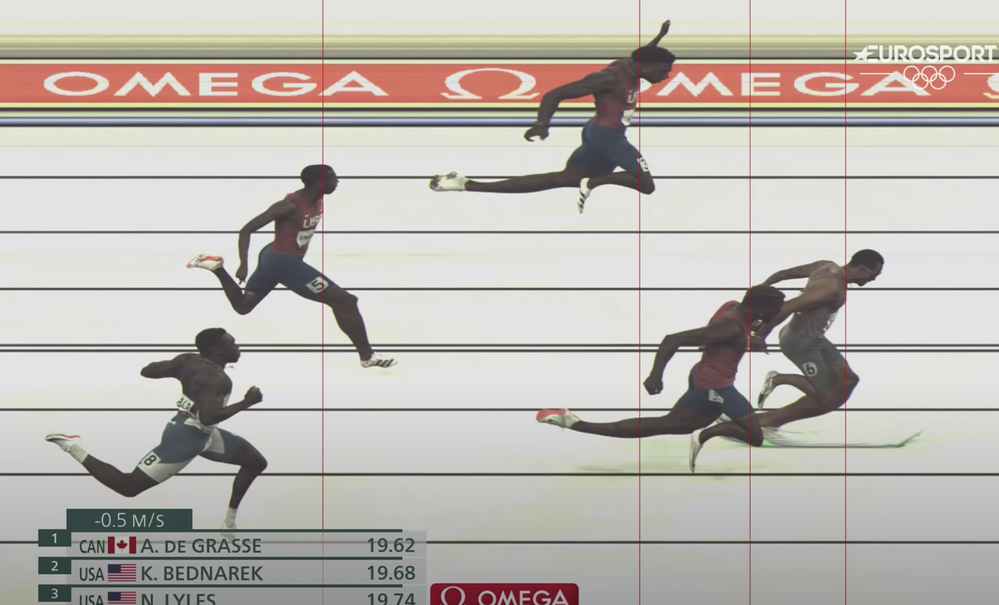
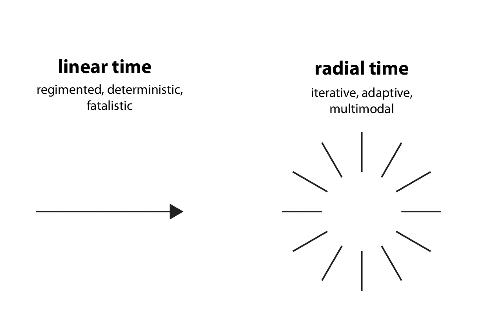
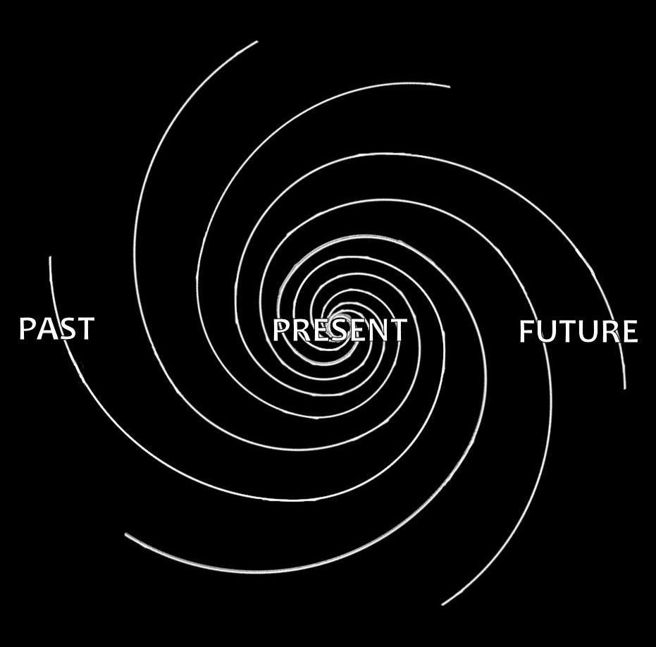
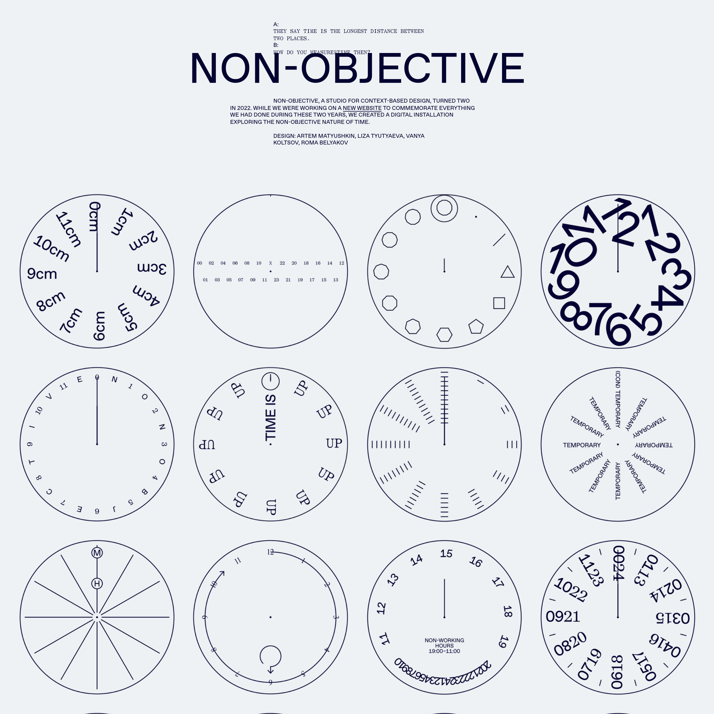

# Importing, Keyframes, Easing

*May 5, 2026* · [← All lectures](index.html)

**TIME CONTINUED**

**Lecture + Demo**
1. Go over issues seen in last class
	1. import svg results in another composition / nested composition. solution -> copy the svg layer directly into your existing composition OR increase the length of the svg precomp.
2. **Review UI & Project Setup**
	- Import AI file as Composition — Retain Layer Sizes
	- Review the default workspace panels, how to restore things if things get wonky
		- composition window
		- timeline
		- project panel
		- effects/character panels, toolbar
	- Importing footage (drag-and-drop, File > Import)
		- SVG
			- Issue — **When you drag a comp into a parent comp, the layer's maximum extent on the timeline is bounded by the source comp's duration.**
			- **a layer's duration in a parent comp is constrained by the source's duration, but its position in time is not**. You can move a 1-second layer anywhere in a 30-second parent comp. You just can't make that 1-second layer last 5 seconds without going back to the source and lengthening it.
			- There's also a workaround that avoids the nested-comp issue entirely: **import the SVG as Footage instead of as a Composition**. In the import dialog, there's an "Import As" dropdown — Footage vs. Composition vs. Composition - Retain Layer Sizes
			- - **Import as Composition** when the SVG/AI has multiple elements you want to animate independently (like the bar shot in your tutorial — bars as separate layers)
			- **Import as Footage** when the SVG is just a static graphic you want to use as a single element (logo, icon, decoration)
		- AI files
		- Video
- **Concepts covered**
	1. Importing + precompositing
		1. Dealing with import issues, new compositions being created etc
	2. Keyframes
	3. Easing and interpolation
		1. Easy ease, showing the difference between non eased and eased
		2. Graph editor

**Outcomes**
- students made another animation or finished their first, this time with easing.
- ended class with a brief show and tell. two students did not share anything.
