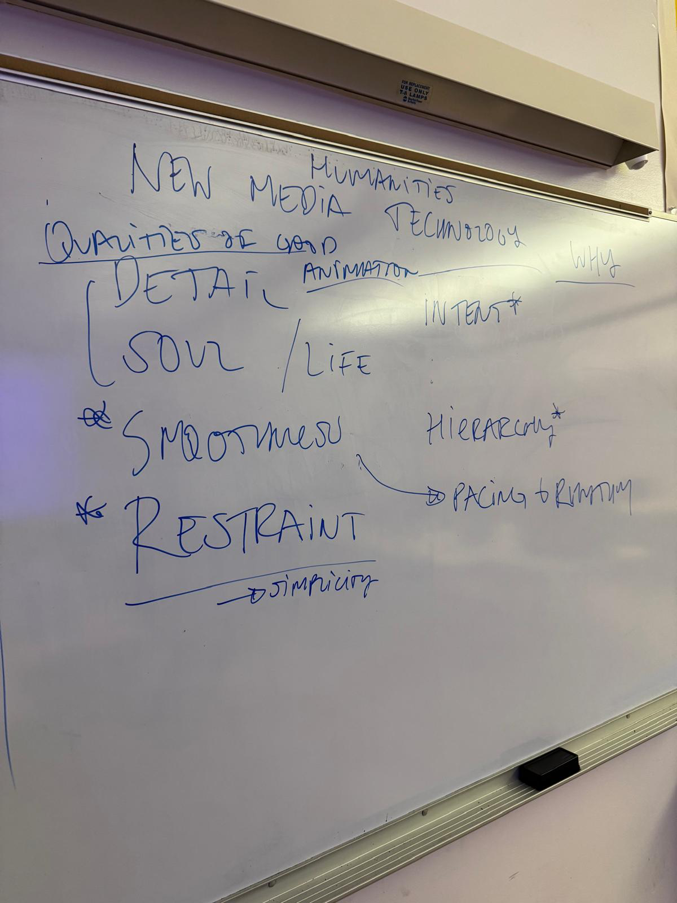

# Animation Principles

*May 12, 2026* · [← All lectures](index.html)

**Intro**

Go over **PARENTING**

"We've spent three classes on technique. Today we learn about what separates animation that works from animation that doesn't, and how do we develop the vocabulary to talk about it."

You know how to make a basic animation now.

**Show animated posters**

**Animation Principles**
1. Intent
	- motion adds a _purpose_ that the still couldn't carry — a thing to communicate, an experience to deliver.
	- [Edward Muybridge](https://www.youtube.com/watch?v=wNU7sXkZmSw)
	- [Breath, Drink Water](https://www.christinalu.com/projects/squarespace)
	- [Se7en](https://www.youtube.com/watch?v=-BJkDyCdw0c)
	- https://every.to/p/invisible-details-of-interaction-design
	- material.io/design/motion
2. Pacing and rhythm
	- Does everything arrive at once? Is there a pace? 
	- [Anatomy of a Murder](https://www.youtube.com/watch?v=QccJ2L-7DVk)
3. Hierarchy and weight
	- Adding animation allows certain things to matter more than others _at specific moments_
	- [Mubi](https://www.pentagram.com/work/mubi-sonic-ident)
4. Restraint
	- motion is also the absence of motion — stillness becomes a choice rather than a default.
	- "**Add motion purposefully, supporting the experience without overshadowing it.** Don’t add motion for the sake of adding motion. Gratuitous or excessive animation can distract people and may make them feel disconnected or physically uncomfortable." — [Apple motion guidelines](https://developer.apple.com/design/human-interface-guidelines/motion)
	- "**Make motion optional.** Not everyone can or wants to experience the motion in your app or game, so it’s essential to avoid using it as the only way to communicate important information. To help everyone enjoy your app or game, supplement visual feedback by also using alternatives like [haptics](https://developer.apple.com/design/human-interface-guidelines/playing-haptics) and [audio](https://developer.apple.com/design/human-interface-guidelines/playing-audio) to communicate."
	- [Wodniak.dev](https://wodniack.dev/)
	- [Climate tech map](https://www.pentagram.com/work/climate-tech-map) (bad example)

**Exercise** **A**
- annotation of one reference
- self-critique of own poster animation
- paired share

**Assignment #3**
- Turn in on Brightspace both versions of your animated poster, before and after
- Write 3 - 4 sentences explaining the following:
	- What did you choose to animate / add motion to?
	- What changes did you make? 
	- How does animating the poster change how it feels or how effective it is?  

**Storyboard**
- 6 frames
- Sketches and words
- Concept:
	- Where do vacations come from?
	- How do animated GIFs work? 
	- Where do clocks come from? 
	- How to beatmatch? 

**Assignment #4**
- 30 - 45 second video
- Pick one of the following formats:
	1. Trailer for a game, movie, or creative project (can be real or imagined)
	2. Documentary style explainer
	3. Promote an event or product
	4. Something else 
- Use a combination of images, animation, video, and sound
- **Due May 21st Thursday**

**Homework** commit to format tonight, sketch storyboard for Thursday.
