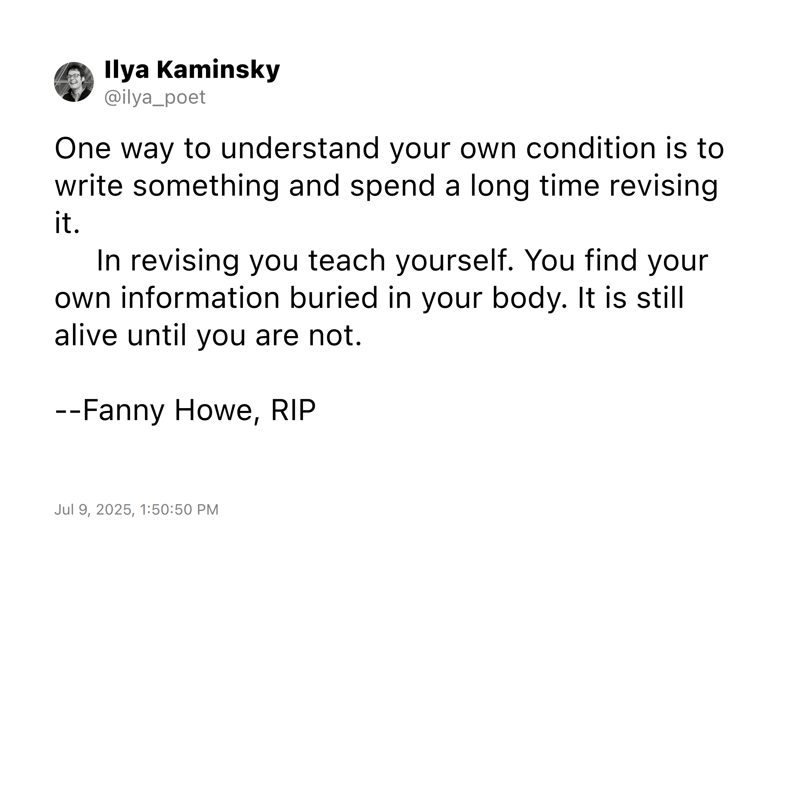
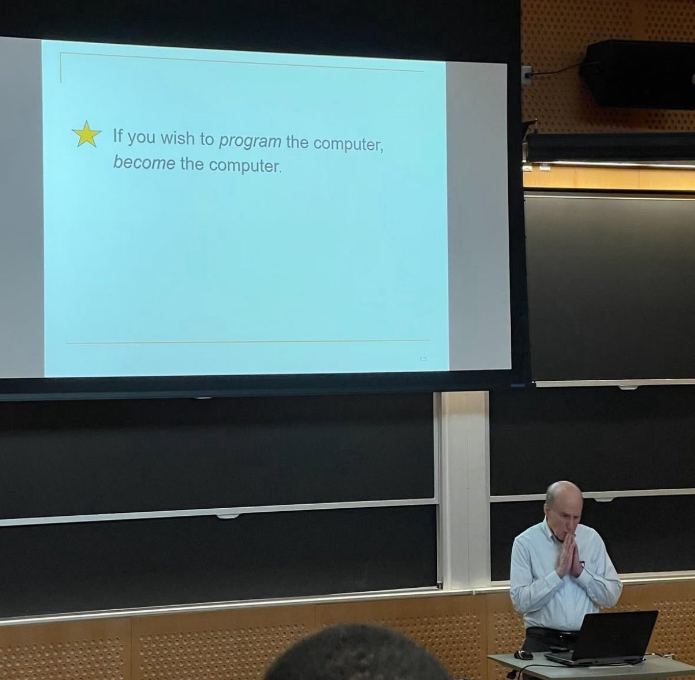
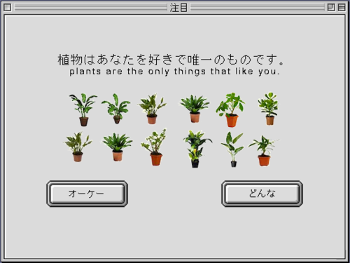

# Websites

*May 19, 2026* · [← All lectures](index.html)

https://thesoundof.love/

What is a website
- https://publicannouncement.org/2022/a-website-is-a-machine-you-leave-outside/
- HTML, CSS, and JavaScript
- Links
- Files — videos, images

How does the Internet work
- Go over the structure of the internet and the web

HTML
- https://www.wired.com/story/html-is-actually-a-programming-language-fight-me/

Why do we need websites?  What categories exist? 
- [websites.lav.io](https://websites.lav.io/)
- Co create a list of all the websites we can think of

Is Instagram a website? 

**Demo — getting set up on Neocities**

1. Create a [Neocities.org](https://neocities.org/) account, choosing a URL, and verify your email.
2. Once verified, head to your [Go to your Neocities dashboard](https://neocities.org/dashboard) or hit `Edit Site` from the home page.
3. You will see this dashboard, which is all the files hosted on your site — a mix of HTML files and styling files. We'll mostly just be making html files (with the `.html` extension at the end.
4. Try to make a change to your site. Hover over the 'index.html' file and change some contents.
5. Hit 'Save', then click 'View' to see your live site.

- [ Getting Started](https://www.htmldog.com/guides/html/beginner/gettingstarted/): What you need to do to get going and make your first HTML page.
- [Tags, Attributes and Elements](https://www.htmldog.com/guides/html/beginner/tags/): The stuff that makes up HTML.
- [Page Titles](https://www.htmldog.com/guides/html/beginner/titles/): Titles. For Pages. A difficult concept, we know…
- [Paragraphs](https://www.htmldog.com/guides/html/beginner/paragraphs/): Structuring your content with paragraphs.
- [Headings](https://www.htmldog.com/guides/html/beginner/headings/): The six levels of headings.
- [Lists](https://www.htmldog.com/guides/html/beginner/lists/): How to define ordered and unordered lists.
- [Links](https://www.htmldog.com/guides/html/beginner/links/): How to makes links to other pages, and elsewhere.
- [Images](https://www.htmldog.com/guides/html/beginner/images/): Adding something a bit more than text…
- [Tables](https://www.htmldog.com/guides/html/beginner/tables/): How to use tabular data.
- [Forms](https://www.htmldog.com/guides/html/beginner/forms/): Text boxes and other user-input thingamajigs.
- [Putting It All Together](https://www.htmldog.com/guides/html/beginner/conclusion/): Taking all of the above stuff and shoving it together. Sort of in a recap groove.

END EXERCISE

1. Go to neocities
2. Set up your website
3. Send your URL in discord

60 minutes to work on your animations or changing your website
