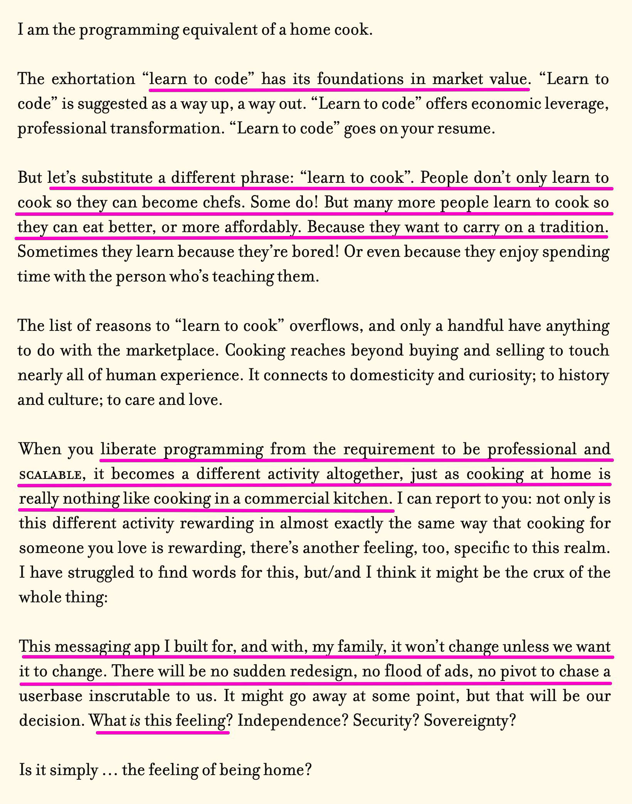
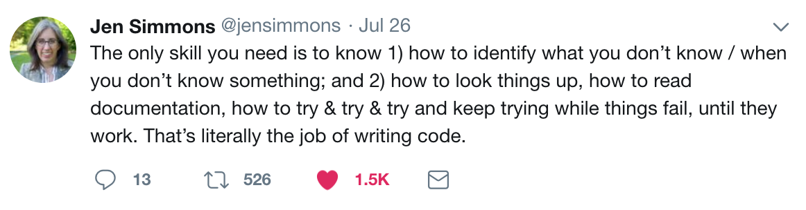

# Layout

*May 25, 2026* · [← All lectures](index.html)

https://www.robinsloan.com/notes/home-cooked-app/


# Laying Things Out: Flexbox & Grid

_HUW 112 · Unit 4: Web_

So far your pages stack straight down: one thing under another. Boring. 

Today we will learn how to put things **next to** each other — rows of images, a navigation bar, a gallery, in a **flex**ible or **grid** layout.

This is the difference between a page that looks like a printout and a page that looks designed.

## The one idea: everything is a box

Every element on a page is a rectangular box. Some boxes **stack** (headings, paragraphs, `div`s — these are _block_ elements). Some sit **in a line** (text, links, images — these are _inline_). CSS layout is mostly about taking control of how those boxes sit next to each other.

Two boxes, two kinds of space around them:

- **`padding`** — space _inside_ the box, between its edge and its content.
- **`margin`** — space _outside_ the box, pushing other boxes away.

If you only remember one thing about layout, remember inside vs. outside. Most layout confusion is a padding/margin mix-up.

→ MDN: [The box model](https://developer.mozilla.org/en-US/docs/Learn_web_development/Core/Styling_basics/Box_model)

## A defensive line for the top of your CSS

```css
* {
  box-sizing: border-box;
}
```

This makes padding and borders count _inside_ an element's width instead of adding to it, so boxes stop unexpectedly getting bigger than you told them to. Put it at the top of every stylesheet and don't think about it again.

→ MDN: [`box-sizing`](https://developer.mozilla.org/en-US/docs/Web/CSS/box-sizing)

## Flexbox — arranging boxes along one line

Use it whenever you want things **in a row** or a **column**: a nav bar, a row of buttons, a gallery of images.

The pattern is always the same: a **container** with **children** inside it. You turn on flex _on the container_, and the children line up.

```css
.gallery {
  display: flex;        /* turn the container into a flex row */
  gap: 20px;            /* space BETWEEN the children */
  flex-wrap: wrap;      /* let children drop to the next line if they run out of room */
  justify-content: flex-start;  /* how children are spaced ALONG the row */
  align-items: flex-start;      /* how children line up ACROSS the row */
}
```

Two properties to play with until they click:

- **`justify-content`** moves things along the row. Try `center`, `space-between`, `space-around`.
- **`align-items`** lines things up across the row. Try `center`, `flex-start`, `stretch`.

The single example that teaches most of flexbox: **a wrapping row of evenly spaced image boxes.** If you can build that, you can build a nav bar, a card layout, and most of what your assignment needs.

→ MDN: [`display`](https://developer.mozilla.org/en-US/docs/Web/CSS/display) · [Basic concepts of flexbox](https://developer.mozilla.org/en-US/docs/Web/CSS/CSS_flexible_box_layout/Basic_concepts_of_flexbox) · [`gap`](https://developer.mozilla.org/en-US/docs/Web/CSS/gap)

### The image gotcha

Images don't go _directly_ into a flex container. Put each image inside its own box (`div`), and let the boxes flex:

```html
<div class="gallery">
  <div class="cover"></div>
  <div class="cover"></div>
</div>
```

Think of it as: **flex arranges boxes; put your stuff in boxes.** Images, text, and video all go _inside_ boxes, not loose in the container.

It also helps to set images to fill their box cleanly:

```css
.cover img {
  display: block;   /* removes a small mystery gap under the image */
  width: 100%;      /* fill the width of the box */
}
```

## Grid — when you want rows AND columns

Flexbox arranges things along **one** line. Grid is for a true **two-dimensional** layout: rows _and_ columns at once, like a checkerboard.

```css
.gallery {
  display: grid;
  grid-template-columns: repeat(3, 1fr);   /* three equal columns */
  gap: 20px;
}
```

- **`1fr`** means "one fraction of the leftover space."
- **`repeat(3, 1fr)`** means "three equal columns." Change the `3` to get more or fewer.
- **`gap`** is the same property as flex.

→ MDN: [Basic concepts of grid layout](https://developer.mozilla.org/en-US/docs/Web/CSS/CSS_grid_layout/Basic_concepts_of_grid_layout)

## Flex or grid — which?

Reach for **flex first.** It handles most things: a row, a column, a wrapping gallery. Reach for **grid** when you specifically need a set of rows and columns lined up together. Most real sites use grid and flex both, in different places.

## Exercise

Take the demo files and make six changes:

1. Change the subject to something _you_ love (new heading, new text).
2. Change three colors: the page background, the text, and an accent.
3. Change the font.
4. Add a fifth box to the gallery (copy a box, paste it, change the text). Watch grid absorb it automatically.
5. Make the `gap` bigger, then the `padding` inside a box bigger. Feel the difference between _between_ and _inside_.
6. Swap the gallery from `display: flex` to `display: grid` and back. See the same content laid out two ways.

## Going deeper


[MDN Web Docs](https://developer.mozilla.org/en-US/docs/Web/CSS) is the reference. When you're stuck, searching "MDN" + the property name (e.g. "MDN flexbox") almost always lands you on a good explanation.

---

**Assignment #4** is due **June 2** — a website about something you love, with text, an image, a video, a navigation, and styling that makes it yours. Today's layout tools are what turn it from a stack of stuff into a page.
